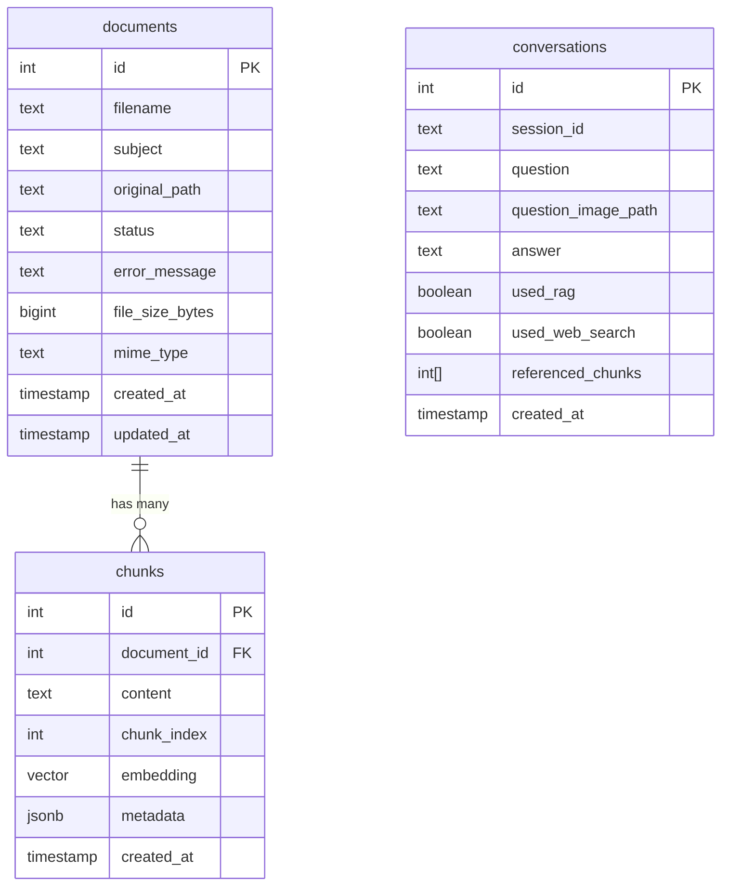

# ER図（テキスト表現 / Mermaid案）

```mermaid
erDiagram
  documents {
    int id PK
    text filename
    text subject
    text original_path
    text status
    text error_message
    bigint file_size_bytes
    text mime_type
    timestamp created_at
    timestamp updated_at
  }
  chunks {
    int id PK
    int document_id FK
    text content
    int chunk_index
    vector embedding
    jsonb metadata
    timestamp created_at
  }
  conversations {
    int id PK
    text session_id
    text question
    text question_image_path
    text answer
    boolean used_rag
    boolean used_web_search
    int[] referenced_chunks
    timestamp created_at
  }

  documents ||--o{ chunks : "has many"
```

関係:
- documents 1 — N chunks
- conversations は documents/chunks に非正規で参照ID配列を保持（将来見直し可）

